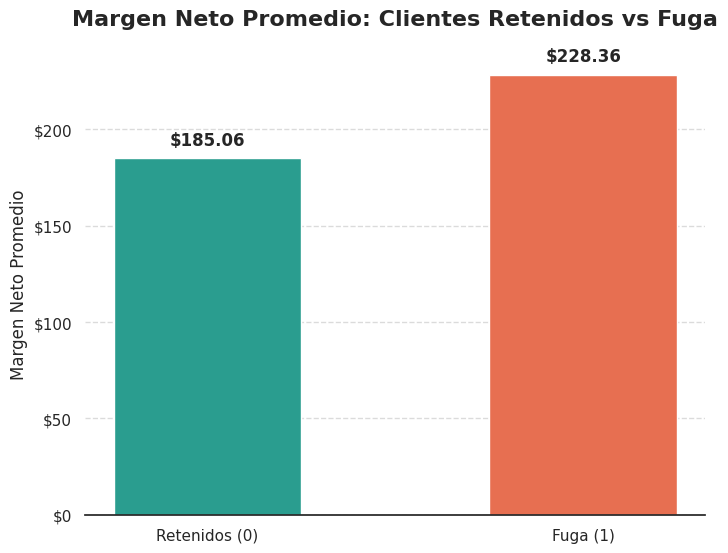
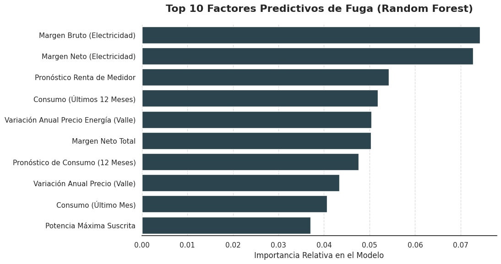

# Predicción de Fuga de Clientes (Customer Churn) y Estrategia de Retención

**Simulación de Data Science - BCG X**

---

## 1. Contexto y Reto de Negocio

PowerCo, una importante empresa proveedora de gas y electricidad para el sector de Pequeñas y Medianas Empresas (PYMES), ha detectado un incremento sostenido en su tasa de abandono de clientes (churn). La hipótesis inicial de la directiva sugiere que la alta volatilidad de los precios es el factor principal que impulsa las cancelaciones. 

El objetivo de este proyecto es auditar dicha hipótesis mediante el análisis exploratorio de datos (EDA), desarrollar un modelo predictivo para identificar a los clientes en riesgo y proponer una estrategia de retención que sea financieramente viable para la compañía.

## 2. Metodología y Herramientas

El proyecto se desarrolló utilizando Python, priorizando un enfoque analítico orientado a la toma de decisiones y la rentabilidad:

* **Procesamiento y Limpieza de Datos:** `Pandas`, `NumPy`
* **Análisis Visual y Diagnóstico:** `Matplotlib`, `Seaborn`
* **Modelado Predictivo:** `Scikit-Learn` (Random Forest Classifier)
* **Evaluación Financiera:** Análisis de Retorno de Inversión (ROI) sobre estrategias de retención.

## 3. Análisis Exploratorio: Desmitificando la Hipótesis Inicial

Contrario a la creencia de la directiva, el análisis de los datos reveló que la sensibilidad al precio **no** es el motor principal del abandono. Al evaluar el perfil financiero de los clientes, se descubrió que el margen neto de ganancia tiene una relación mucho más directa con la retención.

  

*Insight:* Los clientes que se mantienen en la empresa generan un margen neto promedio significativamente mayor. Implementar un descuento generalizado del 20% (como se propuso inicialmente) afectaría drásticamente la rentabilidad sin solucionar la causa raíz de la fuga.

## 4. Modelado Predictivo y Variables Clave

Se implementó un modelo de Machine Learning (*Random Forest*) para predecir la probabilidad de fuga de cada cliente, logrando aislar las variables más determinantes en la toma de decisiones.

  

Como lo demuestra el modelo, los factores que verdaderamente impulsan la retención o fuga son:
1. El Margen Neto Total y el Consumo de los últimos 12 meses.
2. La Antigüedad del Cliente (barrera de salida).
3. Las proyecciones de consumo a futuro.

## 5. Recomendaciones Estratégicas

Con base en los hallazgos técnicos y la evaluación financiera, se emiten las siguientes recomendaciones corporativas:

1. **Rechazo del Descuento Generalizado:** Descartar la propuesta del 20% de descuento masivo, ya que el costo de la promoción superaría los ingresos retenidos, resultando en un ROI negativo.
2. **Estrategia de Retención Focalizada:** Utilizar las probabilidades generadas por el modelo predictivo para identificar *exclusivamente* a los clientes que presentan un alto riesgo de fuga y que, simultáneamente, se ubican en el cuartil superior de margen neto.
3. **Fidelización No Monetaria:** Invertir recursos en mejorar la atención al cliente y renegociar contratos a largo plazo para fortalecer la métrica de "Antigüedad", la cual demostró ser un pilar en la retención orgánica.

---
*Este repositorio contiene el código, los datos procesados y la presentación ejecutiva correspondientes al programa de experiencia laboral virtual de Data Science de BCG X.*
